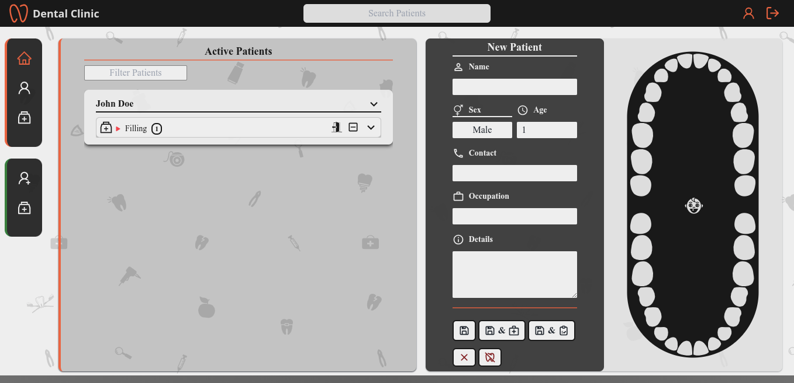
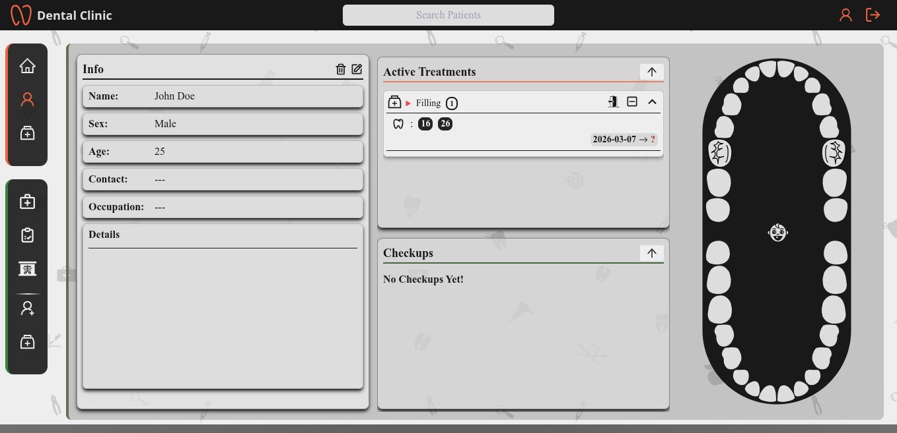

# Dental Clinic Management System

Patient record management and treatment tracking system for dental practices.

## Overview

Digital patient management system built to replace paper-based record keeping for a dental clinic. Managed 50+ patient visits monthly over 2 years of active use, maintaining comprehensive treatment records for hundreds of patients across multiple sessions.

Features a custom interactive tooth chart component for visual treatment tracking and progress documentation.

## Tech Stack

- **Frontend:** React, JavaScript, Tailwind CSS
- **Backend:** Node.js, Express.js, TypeScript, Prisma ORM
- **Database:** SQLite

## Key Features

- **Patient record management** with demographics, contact info, and medical history
- **Interactive tooth chart** for visual treatment tracking and documentation
- **X-ray image storage** and viewing integrated with patient records
- **Treatment history** with dates, procedures, and notes
- **Active/archived patient filtering** for easy navigation
- **Search functionality** for quick patient lookup

## Screenshots

**Landing Page**

**Patient Page**

## Architecture

This application is split into two repositories:

- **Frontend:** React SPA with Tailwind CSS for styling ([Visit Repo](https://github.com/KameilJarrouge/dental_clinic_manager_frontend))
- **Backend:** Express.js REST API with Prisma ORM for database access (You are here)

## Status

In production from January 2023 to December 2024.

## License

MIT License
